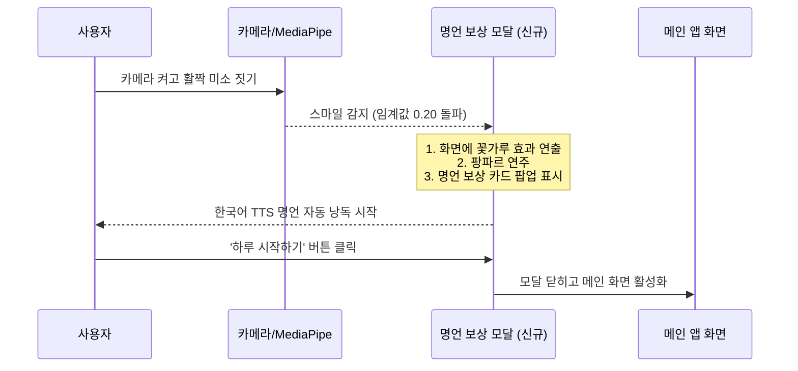

# [시스템 설계도] '어색A 서먹I' 스마일 명언 보상 시스템

본 설계도는 대표님의 승인을 얻은 **A안 (스마일 미소 보상 명언 & 한국어 TTS 낭독)**을 구현하기 위한 세부 기술 설계서입니다. 기존의 강점을 유지하며 요구사항에 맞춰 정밀하게 시공합니다.

## 1. 기술 스택 & 모듈 아키텍처
* **얼굴 인식**: MediaPipe FaceLandmarker (실시간 온디바이스 판별)
* **음향 합성**: Web Audio API (로컬 Oscillator 칩셋 구동, 오프라인 및 보안 무풍지대)
* **음성 합성 (TTS)**: Web Speech API (`SpeechSynthesisUtterance` 기반 `ko-KR` 음성 엔진 활용)
* **UI/UX**: HTML5, CSS3 Glassmorphism Overlay (기존 디자인 완전 보존 법칙 준수)

## 2. 화면 흐름 및 제어 로직 (Sequence Flow)

## 3. 세부 설계 사항

### A. 명언 카드 UI 구조 (Overlay Modal)
기존의 유리 질감 스타일을 유지하기 위해, 메인 콘테이너 위에 떠 있는 고품격 오버레이 모달로 설계합니다.
* 클래스명: `.quote-modal`
* 스타일 속성: `backdrop-filter: blur(25px)`, `border-radius: 24px`, `background: rgba(15, 23, 42, 0.9)`
* 레이아웃:
  * 제목: `🎁 오늘의 미소 보상 명언`
  * 명언 내용(한글): 크고 웅장한 타이포그래피 (Serif 계열 스타일 권장)
  * 명언 원문(영어): 이탤릭체 스타일로 은은하게 표시
  * 저자 정보: `— 저자 이름`
  * 액션 버튼: `오늘 하루도 파이팅! 😊` (클릭 시 모달 제거 및 메인 진입)

### B. 한국어 TTS 구동 설계
* `window.speechSynthesis` 객체를 활용합니다.
* 사용자가 모바일을 쓸 때 음성 대기열이 꼬이는 것을 방지하기 위해 `speechSynthesis.cancel()`을 선제 실행합니다.
* 낭독 언어는 반드시 한국어(`ko-KR`)로 고정하며, 부드러운 목소리 톤을 위해 배속(`rate = 0.95`)과 피치(`pitch = 1.0`)를 튜닝합니다.

### C. 데이터 세트 설계 (Local Fallback Wise Quotes)
실시간 API 차단 리스크를 원천 배제하기 위해, 세계에서 가장 사랑받는 인생 및 미소에 관한 명언 30선을 자바스크립트 내장 배열 형태로 추가 탑재합니다.
